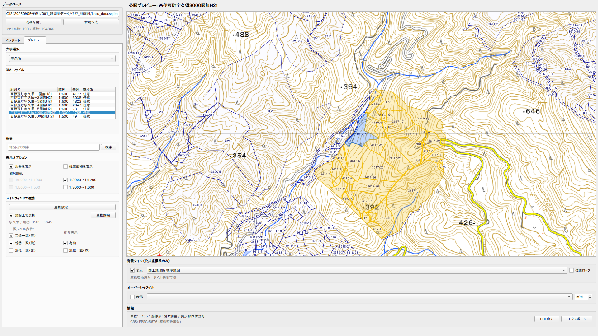
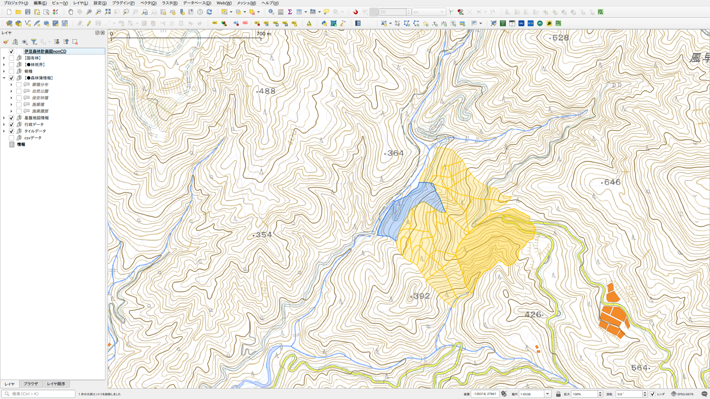

# Kozu XML Integrator / 公図XML整合ツール

A QGIS plugin that cross-references Japanese Legal Affairs Bureau cadastral map XML (Kozu) with forest planning maps and parcel information, applies minor positional adjustments, and provides support for survey investigations.

This plugin does not perform automatic boundary determination. It is intended for area determination for on-site boundary verification.

The plugin identifies the target area by matching the Oaza (district name) in the XML file with the Oaza in the forest planning map, so a layer with Oaza district boundaries is required.

---

法務局地図XML（公図）を森林計画図の地番情報と照合し、位置の微調整を行い照合する調査のサポートを提供します。

境界の自動確定は行わず、現地立会いのための区域確定を目的とします。

XMLファイルに含まれる大字と森林計画図の大字を照らし合わせ区域を判別するので、大字区域がわかるレイヤーが必要です。

## Features / 主な機能

- Import cadastral map XML from Legal Affairs Bureau ZIP files (supports nested ZIP structure) / 法務局配布ZIPファイルからの公図XML読み込み（2重ZIP構造対応）
- Optional post-import ZIP rename with municipality name (e.g. `22219-0803-2024.zip` → `22219-0803-2024_賀茂郡西伊豆町.zip`) / インポート後のZIPリネーム（_行政区画名を追記）
- Cross-reference parcel numbers with forest planning maps / 森林計画図との地番照合
- Coordinate transformation and positional adjustment / 座標変換・位置調整
- Overlay tile display (supports QGIS registered XYZ connections and project layers) / オーバーレイタイル表示（QGIS登録済みXYZ接続・プロジェクトレイヤー対応）
- Export as GIS layer / GISレイヤとしての出力

## Screenshots / スクリーンショット

## Note on Data Compatibility / データ互換性について

> This plugin has been developed and tested with forest planning map data published as open data by Shizuoka Prefecture, Japan. While the plugin's functionality is designed to be generic, the expected attribute structure (field names, parcel number format, etc.) is based on this dataset. If you use forest planning map data from other prefectures or sources, differences in data structure may cause the plugin to not function correctly. Please verify that your data structure matches before use.

> 本プラグインは静岡県が公開する森林計画図オープンデータを基に開発・動作確認を行っています。プラグインの機能自体は汎用的ですが、想定する属性構造（フィールド名・地番形式等）は同データに準拠しています。他県や他のデータソースの森林計画図を使用する場合、データ構造の違いにより正常に動作しない可能性があります。ご利用前にデータ構造の整合性をご確認ください。

## Data Terms / データ利用について

This plugin uses 登記所備付地図データ (Legal Affairs Bureau Cadastral Map Data) published by the Ministry of Justice, Japan.

- The accuracy of this data varies depending on when it was created.
- Users must not publish or use processed/edited data in a manner that implies it was created by the national government.
- The Ministry of Justice assumes no responsibility for any use of this data.
- When publishing edited or processed 登記所備付地図データ, please include a source attribution such as:
  「登記所備付地図データ ○○市」（法務省）（当該ページの URL）を加工して作成

---

本プラグインは「登記所備付地図データ」（法務省）を使用します。

- この情報は作成時期により精度が異なります。
- ユーザーは加工・編集したデータをあたかも国が作成したかのような態様で公表・利用するかまたは政府作成として公表・利用してはなりません。
- このデータの利用行為について法務省は一切責任を負いません。
- 編集・加工した「登記所備付地図データ」を公表する場合には次のような例に沿って出典を記載してください：
  「登記所備付地図データ ○○市」（法務省）（当該ページの URL）を加工して作成

## Requirements / 動作要件

- QGIS 3.40 or later (LTR) / QGIS 3.40 以降（LTR）

## Installation / インストール

### From QGIS Plugin Manager / プラグインマネージャから

1. Open QGIS and go to **Plugins > Manage and Install Plugins**
2. Search for "Kozu XML Integrator"
3. Click **Install**

### Manual Installation / 手動インストール

1. Clone or download this repository / このリポジトリをクローンまたはダウンロード
2. Copy the `kozu_xml_integrator` folder to your QGIS plugin directory:
   - Linux: `~/.local/share/QGIS/QGIS3/profiles/default/python/plugins/`
   - Windows: `%APPDATA%\QGIS\QGIS3\profiles\default\python\plugins\`
   - macOS: `~/Library/Application Support/QGIS/QGIS3/profiles/default/python/plugins/`
3. Restart QGIS and enable the plugin in the Plugin Manager / QGISを再起動し、プラグインマネージャから有効化

## Support / サポート

If this plugin is helpful for your work, you can support the development here:
開発を応援していただけると嬉しいです。
https://paypal.me/rawslnc

## License / ライセンス

GNU General Public License v2 or later

## Author / 作者

Copyright (C) 2026 Hideharu Masai
